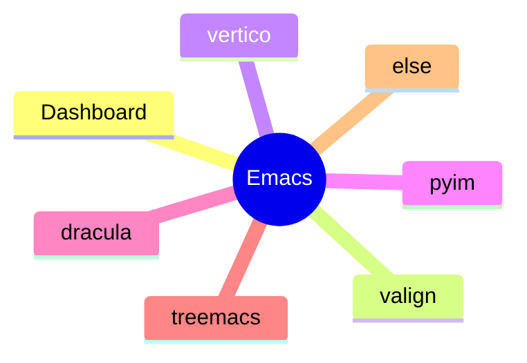

---
{"dg-publish":true,"permalink":"/主题/环境配置/环境配置，emacs/","tags":["环境配置"]}
---


# emacs29配置



## emacs简介

emacs是一个可利用elisp内置语言和elpa仓库进行自定义扩展的文本编辑器。

- 相关网站：
  - [emacs官网](https://www.gnu.org/software/emacs/)
  - [维基：emacs](https://zh.wikipedia.org/wiki/Emacs)
  - [emacs-china论坛](https://emacs-china.org/)
  - [Reddit: emacs](https://www.reddit.com/r/emacs/?rdt=50949)
  
## 配置说明

本配置用于说明一些常用的emacs配置，emacs版本， snap-emacs-29 。
emacs配置文件位于 `~/.emaca.d/init.el` 或 `~/.emacs` 中。


### elpa 仓库配置

- [ELPA 镜像使用帮助](https://mirrors.tuna.tsinghua.edu.cn/help/elpa/)

```elisp
(setq package-archives '(("gnu"    . "http://mirrors.tuna.tsinghua.edu.cn/elpa/gnu/")
                         ("nongnu" . "http://mirrors.tuna.tsinghua.edu.cn/elpa/nongnu/")
                         ("melpa"  . "http://mirrors.tuna.tsinghua.edu.cn/elpa/melpa/")))
(package-initialize) ;; You might already have this line
```
### Dashboard

一个面板，显示近期文件和书签。

```elisp
(use-package dashboard
  :ensure t
  :config
  (dashboard-setup-startup-hook))
```

### valign

当向org和markdown文本中的表格中插入一些中文文档时，表格无法对齐。
valign插件可以辅助对齐。

```elisp
;; use-package with package.el:
(use-package valign
  :ensure t
  :config
  (add-hook 'org-mode-hook #'valign-mode)
  (add-hook 'markdown-mode-hook #'valign-mode))
```

### Vertico

在迷你窗口打开文件命令时增加相关显示。

```elisp
(use-package vertico
  :ensure t
  :config
  (add-hook 'emaca-startup-hook #'vertico-mode))

```

### Pyim

中文输入法。

```elisp
(use-package pyim
  :ensure t
  :config
  (require 'pyim)
  (require 'pyim-basedict)
  (pyim-basedict-enable)
  (setq default-input-method "pyim")
  (pyim-default-scheme 'ziranma-shuangpin))
```

### dracula-theme

黑色主题，耐看。

```elisp
(use-package dracula
  :ensure t
  :config
  (load-theme 'dracula))
```

### treemacs

方便管理项目。

### 其它

透明显示
```elisp
;;set transparent effect
(global-set-key [(f11)] 'loop-alpha)
(setq alpha-list '((100 100) (95 65) (85 55) (75 45) (65 35)))
(defun loop-alpha ()
  (interactive)
  (let ((h (car alpha-list)))                ;; head value will set to
    ((lambda (a ab)
       (set-frame-parameter (selected-frame) 'alpha (list a ab))
       (add-to-list 'default-frame-alist (cons 'alpha (list a ab)))
       ) (car h) (car (cdr h)))
    (setq alpha-list (cdr (append alpha-list (list h))))
    )
)
```
栏目隐藏
```elisp
;;菜单栏隐藏
(menu-bar-mode 0)
;;工具栏隐藏
(tool-bar-mode 0)
```

全屏

```elisp
(toggle-frame-fullscreen)
```


## 参考

- [Github:casouri/valign](https://github.com/casouri/valign)
- [Github:emaca-dashboard/emaca-dashboard](https://github.com/emacs-dashboard/emacs-dashboard)
- [Github:Alexander-Miller/treemacs](https://github.com/Alexander-Miller/treemacs)
- [Github:dracula/emaca](https://github.com/dracula/emacs)
- [Github:minad/vertico](https://github.com/minad/vertico)
- [Github:tumashu/pyim](https://github.com/tumashu/pyim)
- [Github:emacs-dashboard/emacs-dashboard](https://github.com/emacs-dashboard/emacs-dashboard)
- [Emacs-China:Emacs 透明窗口](https://emacs-china.org/t/emacs/2405)
