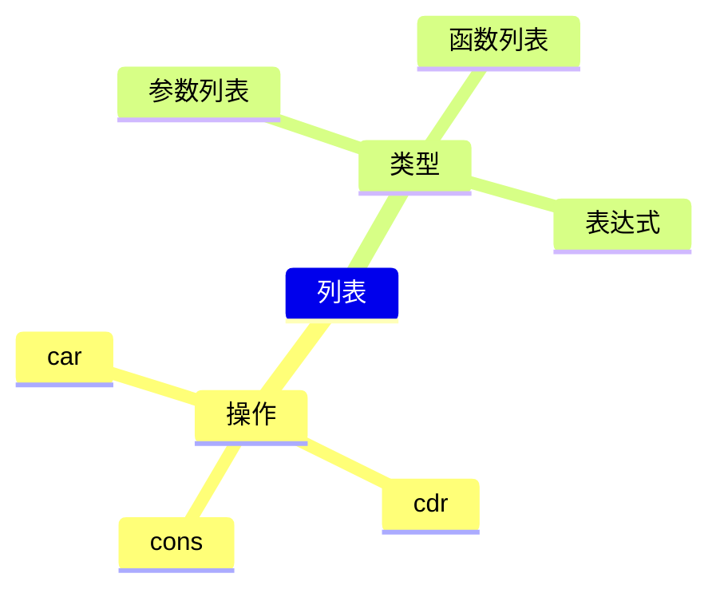
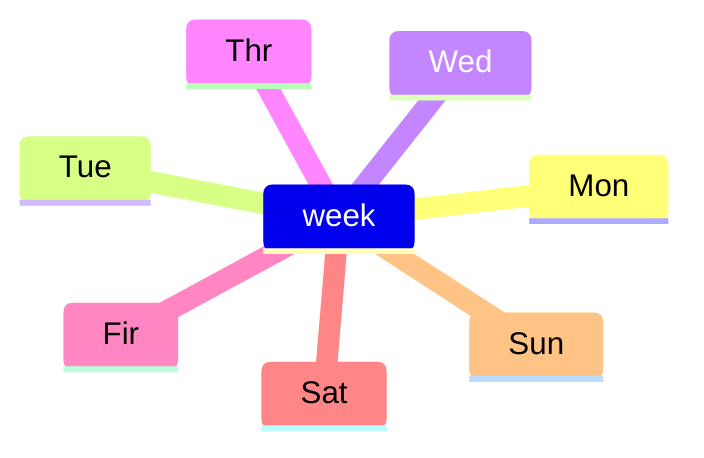
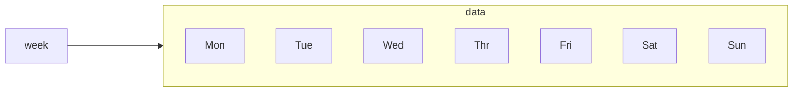
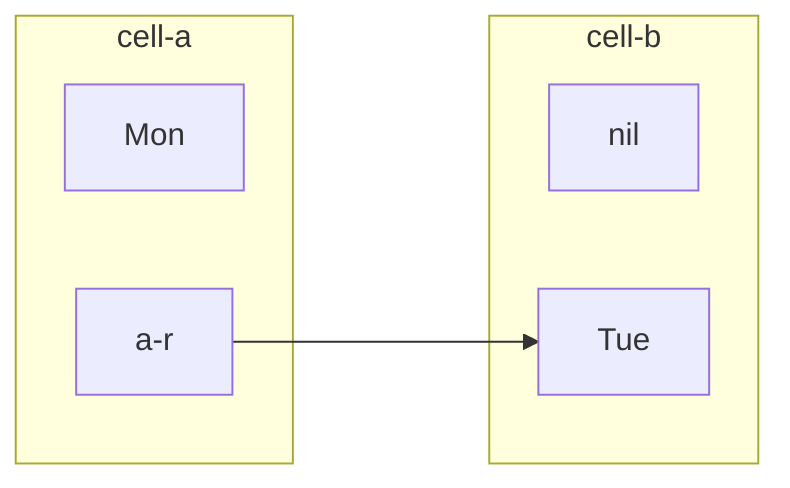
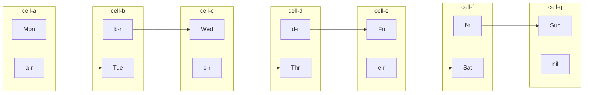
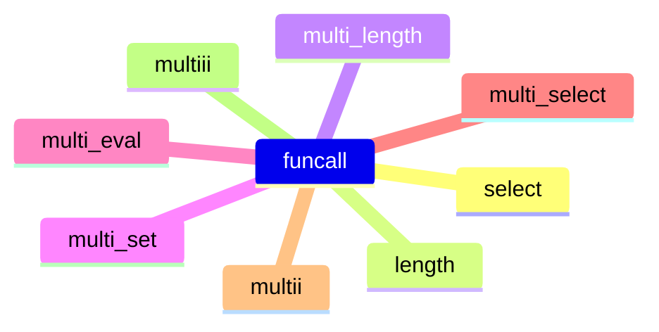

---
{"dg-publish":true,"permalink":"/主题/编程语法/lisp 基础语法，列表/"}
---




## 简介

在上一篇博客中，我们试图说明，lisp的一切对象都可以视为一种符号对于另一种符号的指向，同时介绍了指针型指向和函数型指向的基本语法。这一片笔记记录列表类型。


## 列表：cons, car ,cdr

列表是由括号 `()` 包裹的符号，符号之间用空格分开。每一个符号指向另一个列表或符号。

`3` 和 `(+ 1 1 1)` 在数量上的返回结果是相同的。如果我们仅仅想要标示一种物品的数量，我们更习惯用 `3` 。这是因为，每次提到该物品的数量时， `3` 就读写意义上的能量消耗更小。
我们姑且把这类能量消耗更小的符号称为`更精简的符号`。

例如，当我们记录了一周的体温后，便可以用 `本周体温.txt` 来替代该文件中的体温数据本身。这时候，每一天的体温和本周体温便形成以下一对多的映射关系：

```lisp
(set 'week '(Mon Tue Wed Thr Fir Sat Sun))
```





例如，设37.4~37.8摄氏度是低度发烧，而我们想要从一周中寻找低度发烧的 `Monday` ，那么我们不得不从 `week` 整体中选择 `Monday` 这一部分。

如果存在一个函数如下所示的返回制定位置的符号便好了：

```lisp
(select '低烧' from week)
;;we expecte: => Mon
;;Actually: => Symbol's function definition is void: select
```

遗憾的是，这是一个过于“高级”的函数，elisp并不会提供它的直接实现。我们要从一些更加低层的函数出发组装它。


我们可能想象着：





然而实际上，在lisp语言中，`week` 是通过一种被称为 `cell` 的二元组来构成的。

>The smallest basic unit of a plant or animal.
>
>细胞
>
>A small room with not much furniture, especially in a prison or a monastery or convent
>
>小房间；单间牢房

根据剑桥辞典的解释，我们暂称这种 `cell` 为小房间。每一个小房间有且仅有两个小孔（slot），左侧的小孔记录符号，右侧的小孔负责指向。每一个小房间可以通过右侧的小孔连到下一个房间中。

例如：



其lisp语言表达为：

```lisp
(cons Mon (cons Tue nil))
```
类似地，我们可以构成要构成一周的体温数据：

```lisp
(set 'week (cons 'Mon (cons 'Tue (cons 'Wed 
	(cons 'Thr (cons 'Fri (cons 'Sat
		(cons 'Sun nil))))))))
```




这就是week列表的构成方式。便构成了我们直观意义上的列表，

现在如果我们要访问其中的某个cell，lisp为我们提供了两种操作，选择当前列表的首项 `car` 或者选择当前列表首项以外的元素 `cdr` 。


例如，如果我们要选区周三 `Wed` ，可以通过以下代码实现：

```lisp
(car (cdr (cdr week)))
```

对于访问列表 $x$ 的第 $n$ 个元素，只需要 $n-1$ 个表达式调用`cdr`原语，最后用 `car` 访问当前 `cell` 的列表数据即可。

为了更方便访问列表任意位置元素，我们可以编写一个高级函数 `select`：

```lisp
(set 'select (lambda (list position)
	(if (eq position 1)
		(car list)
		(if (> position 1)
			(funcall select (cdr list) (- position 1))
			(if (< position 1)
				nil)))))
```
原理很简单，如果位置 `position` 的值不为一，便继续使用 `cdr` 原语同时令 `position` 减一。直到 `position` 的值为一，返回当前列表首项。

有两个小问题。

1. 如果 `position` 是非正整数，无论减多少次一，都不会抵达递归的结束条件 `position` 为一。这种情况下，为了避免陷入死循环，需要增加 `position` 为负数返回 `nil` 的分支。

2. 如果 `position` 大于列表长度，由于 `position` 一定可以在有限步内减小至一，以及 `nil` 的 `cdr` 依然是`cdr`，所以该情形下不会陷入死循环。

测试一下，选择 `week` 第五个元素 `Fri`：

```lisp
(funcall select week 5)
;;=>Fri
```
选择一个负位置或超长位置，比如 `-3`和`8`

```lisp
(funcall select week -3)
;;=>nil
(funcall select week 8)
;;=>nil
```


那么如果我怀疑 `week` 的长度到底是不是7天呢？（我担心之前创建数组时忘记了一天。）

设置一个长度函数 `length`：

```lisp
(set 'length
     (lambda (list)
       (if (eq (eq list nil) nil)
	   (+ 1 (funcall length (cdr list)))
	 0
	 )))
```

原理是，直到空为止，每遍历一个元素，便让返回值加一。

测试：

```lisp
(funcall length week)
;;=>7
```
现在赋予 week 中的每一天以一个温度的数值，但是一个一个赋值太麻烦了，能不能为
`week` 中包含的每个元素一次性赋值呢？

创建一个 `multi-set` 函数，我想给它两个参数，一个是变量列表，一个是值列表，然后利用 `set` 将变量指向相应值。
这首先要求变量列表和值列表的长度相同。

那么先设置一个判断长度相同的函数：

```lisp
(set 'length-eq
       (lambda (list-a list-b)
	 (if (eq (funcall length list-a) (funcall length list-b))
	     t nil)))
;;(funcall length-eq '(a b c) '(1 2 3))
;;=>t
;;(funcall length-eq '(a b c) '(1 2 3 4))
;;=>nil
```
变量列表和值列表相同的条件下，用 `set` 赋值。

```lisp
(set 'multi-set
     (lambda (variables values)
       (if (funcall length-eq variables values)
	   (if (eq (eq variables nil) nil)
	       (cons (set (car variables) (car values))
		     (funcall multi-set (cdr variables) (cdr values)))
	     nil)
	 nil)))
;;(funcall multi-set `(a b c) '(1 2 3))
;;(list a b c)
;;=>(1 2 3)
```

现在尝试为一天记录一个体温。

```lisp
(funcall multi-set week '(36.5 36.4 37.2 36.8 36.9 36.7 36.4))
```

既然可以一次性访设置多个指针，那么为什么不能一次性访问多个指针呢？

```lisp
(set 'multi-eval
     (lambda (var-list)
       (if (eq (eq var-list nil) nil)
	   (cons (eval (car var-list)) (funcall multi-eval (cdr var-list)))
	 nil)))
;;(funcall multi-eval week)
;;=>(36.5 36.4 37.2 36.8 36.9 36.7 36.4)
```

从中我们看到一种更加普遍的形式， `multi` ，对于列表中的每一项执行某个函数：

```lisp
(set 'multi
       (lambda (fun vars)
	 (if (eq (eq vars nil) nil)
	     (cons (funcall fun (car vars)) (funcall multi fun (cdr vars)))
	   nil)))
;;(funcall multi length '((1 2) (2 3 4)))
;;=>(2 3)
```

这和 `mapcar` 的功能是一致的。

```lisp
(mapcar length '((1 2) (2 3 4)))
;;=>(2 3)
```

但是对于 `select` 这样具有两个参数输入的函数，`multi` 是无法处理的。
例如，我想选择 `week` 中第二天和第三天温度构成一个新的列表。

```lisp
(set 'multii
       (lambda (fun list vars)
	 (if (eq (eq vars nil) nil)
	     (cons (funcall fun list (car vars)) (funcall multii fun list (cdr vars)))
	   nil)))
;;(funcall multii select '(a b c d e) '(2 3 1))
;;=>(b c a)
;;(funcall multi-eval (funcall multii select week '(2 3)))
;;=>(36.4 37.2)
```

是时候区分一下函数列表和变量（指针）列表了。

如果我想单独设置七个函数，分别用于选择列表的1~7个元素如何？
我完全可以在 `select` 函数的基础之上加以选择

```lisp
(set first '(lambda (x) (select x 1)))
(set second '(lambda (x) (select x 2)))
(set second '(lambda (x) (select x 3)))

...
```
这样一来，从 `week` 中选取第二天和第三天就可以从多个参数输入一个函数，转向多个函数处理一个参数：

```lisp
(set 'multiii
	(lambda (funs var)
		(if (eq (eq funs nil) nil)
		(cons (funcall (car funs) var) (funcall multiii (cdr funs) var))
	nil)))
;;(funcall multiii (list first second third) week)
;;=>(Mon Tue Wed)
;;(funcall multiii `(first second third) week)
;;=>wrong!
```

这里的 `first` `second` `third` 都是对单一参数进行处理的函数，它们共同组成了函数列表。
另一种列表是`Mon` `Tue` 等温度数据组成的参数（指针）列表，
参数列表和函数列表并不能如表达式 `(+ 1 1)` 一样被直接运行。
但是将参数列表和函数列表分开，用 `multi` 这样的函数再把它们结合在一起，例如 `todo`。

现在我们不在用 `week` 记录温度，而记录日程表。

例如：

```lisp
(set 'Mon '(task-1 task-2))
...
```

那么，利用 `multiii` 同具体周脱离的特性便可以制定面向一般周 `week-x` 的习惯：

```lisp
(set 'habits '(habit-1 habit-2 ...))
(funcall multiii habits week-x)
```

当需要调整习惯时，只需要利用 `car` `cdr` `cons` 调整函数列表 `habits` 即可，而不必牵涉到每天的具体任务。
同理，调整习惯保持的时间段，只需要修改参数列表 `week-x` 即可，而不必牵涉到习惯的具体内容。




## 总结

本篇笔记以温度记录为例，分析了列表的而基础结构和操作，区分了函数列表，参数列表和表达式三种不同的列表，同时对 `multi` 函数加以探索以结合参数列表和函数列表。


## 参考


- [GNU: Emacs Lisp Reference Manual](https://www.gnu.org/software/emacs/manual/elisp.html)

