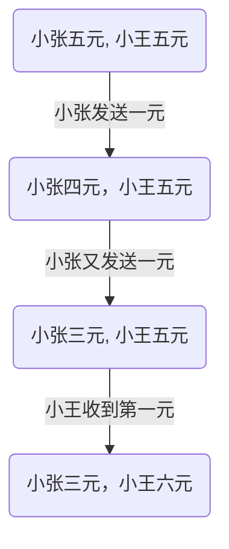

---
{"dg-publish":true,"permalink":"/数字花园/TLAPlus/TLAPlus 练习，电报问题/","tags":["练习","TLAplus"]}
---


## 电报问题描述

现在请你设计一个电报交换系统，包括以下几个条件：

- 每一个电报只能在银行中两个不同的人间进行传递，而且每个电报至少一美元。
- 如果电报是成功的，那么电报的值便会从发送者方减去，而加在接收方的账户中。
- 如果电报失败，两个账户将没有任何改变。
- 电报不能让任何一个账户是负值。
- 多个电报可能同时发生。


## 单进程建模

### 单进程代码

```PlusCal
EXTENDS Integers

(*--algorithm wire
variables
    people = {"Zhang", "Wang"},
    acc = [p \in people |-> 5],
    sender = "Zhang",
    reciver = "Wang",
    amount \in 1..4;
        
define
        NoOverdrafts == \A p \in people: acc[p] >= 0
end define;

begin
    Withdraw:
        acc[sender] := acc[sender] - amount;
    Deposite:
        acc[reciver] := acc[reciver] + amount;
end algorithm;**)
```


### 报错情况设置

其中，如果修改 amount 的值为 范围 1..6，则会报错。


因为小张和小王的初始金额都是5，如果一次电报发送6美元，无论谁发都会出现负值。

不过有意思的是错误数量。

分别试试把 `amount` 设为 1..7，1..9看看吧。

- `amount \in 1..6`
	- 
- `amount \in 1..7`
	- 
- `amount \ in 1..9`
	- 
可以看到的是，错误检测始终只报出一个错误，似乎是检测到错误就停止了。但是可区分的状态却有所不同。

> [!faq] Diameter，States Found，Distinct State，Queue Size分别是什么？有什么方法可以在无错状态下查看执行路径？


## 多进程处理

### 多进程代码

```PlusCal
EXTENDS Integers

(*--algorithm wire
variables
    people = {"Zhang", "Wang"},
    acc = [p \in people |-> 5];
        
define
        NoOverdrafts == \A p \in people: acc[p] >= 0
end define;

process Wire \in 1..2
    variables
        sender = "Zhang",
        reciver = "Wang",
        amount \in 1..acc[sender];

begin
    CheckFonds:
        if amount <= acc[sender] then
            Withdraw:
                acc[sender] := acc[sender] - amount;
            Deposit:
                acc[reciver] := acc[reciver] + amount;
        end if;
end process;

end algorithm;**)

```

### Error Trace

执行上述代码，我们来看看 Error Trace 是什么样的吧。

> [!example] Error Trace

- Error Trace
	- S1
		- 
	- S2
		- 
	- S3
		- 
	- S4
		- 
	- S5
		- 

看完这些，你会发现，pc代表机器所处的状态。

里面的两个值分别代表两个机器本身处于什么状态。

比如说：


这代表第一个进程处于 `CheckFonds` 状态，而第二个进程也处于 `CheckFonds` 状态。

那么这整个堆栈显示了什么错误呢？

我们可以看到 amount 的值为`<1, 5>`，这意味着在该情形下，第一个进程要发1美元，第二个进程要发5美元过去。

而错误发生在第四步到第五步之间。发生了什么呢？

小张想给小王寄5美元钱，但是只有4美元，减去后发现账户余额变成负一美元。这种错误超过了`acc[p]>0` 的约束条件。

而这五个步骤中整体发生了什么呢？

小张想给小王寄钱，在小王还没有收到钱时，小张第一次寄一美元，第二次寄五美元，账户变成负值。

### 把 Check 和 Withdraw 放在一起

那我们要怎样规避这些错误呢？

来看看教材给出的方案吧。


它把检查和账户减发送金额的步骤合在了一起。这样，当小张发送一美元完成检查时，由于金额一并被减去了，所以进程二检查时发送的金额不会再超过现有金额四美元。

```tla+
EXTENDS Integers

(*--algorithm wire
variables
    people = {"Zhang", "Wang"},
    acc = [p \in people |-> 5];
        
define
        NoOverdrafts == \A p \in people: acc[p] >= 0
end define;

process Wire \in 1..2
    variables
        sender = "Zhang",
        reciver = "Wang",
        amount \in 1..acc[sender];

begin
    CheckAndWithDraw:
        if amount <= acc[sender] then
                acc[sender] := acc[sender] - amount;
            Deposit:
                acc[reciver] := acc[reciver] + amount;
        end if;
end process;

end algorithm;**)


\* BEGIN TRANSLATION
```

现在没有问题了。

## Temporal Properties 时间属性

之后要做什么？

整体金额不变的部分称为 `Temporal Properties` ，世俗的属性，时间的属性。而每次金额不变的属性称为 `invariants` ，也就是不变量。两者最大的区别目前看来是是否需要跨越不同的系统状态进行检查。 `invariants` 只需要在状态内检查属性就可以了。不过 `Temporal Properties` 则需要综合不同的系统状态考虑约束条件。


语法格式变得奇怪了。

`EventuallyConsistent` ，最终不变的。

> [!faq] 问题是在 `PlusCal` 中，`<>[]()` 是什么表达？

- 一个错误
	- 
	- 定位到这一部出现错误。
	- 整行代码是：
	- 
	- 检查错误报告是：
	- 

来看看DuckDuckgo上有什么答案吧。

经过检查，我发现了自己的错误。

首先来解释 `<>[]P` 这个表达的含义吧。

根据[TLC手册](https://www.learntla.com/core/temporal-logic.html)的表达，

| 语法      | 含义                        |
| :------ | ------------------------- |
| `[]P`   | P总为真                      |
| `<>P`   | P最终为真                     |
| `[]~P`  | P总为假                      |
| `~[]P`  | P不总为真，有假的情况               |
| `<>[]P` | 最终P总为真（中间状态可以为假，但首尾状态应为真） |
| `[]<>P` | P总最终为真                    |

看起来真是相当复杂的表述。

在上述错误报告中，注意看属性设置。


正如这个图像所展示的，TLC有三个可以检查的量：==Deadlock==，==Invariants==，==Properties==。

之前我把 ==`EventuallyConsistent`== 这个属性放在 `Invariants` 中，导致模型检查错误。

更正属性检查后继续执行代码，依然会报错。

- ErrorTrace
	- 状态1：
		- 
	- 状态2：
		- 
	- 状态3：
		- 
	- 状态4：
		- 

那么这种可能性中发生了什么呢？



恩......为什么小王没有收到最后一元呢？

系统进行到第五步的时候出错了。


==`<Stuttering>`==  这是什么意思？

> Stuttering is when a process simply stops. There’s nothing preventing the wire from making the deposit, it just doesn’t try.

当一个进程停止时，没有阻止电报造成 deposit ? 

大概意思可能是，在状态4，进程2停止时，按照 `EventuallyConsistent` 的声明，系统总金额应该“最终”等于10。不过由于另一个进程的1元还没有送到，所以系统状态违反了时间属性的约束，就报错了。

那有什么处理方法吗？

作者说，可以放松 `NoOverdrafts`或 `EventuallyConsistent`  条件，尝试不同的执行，告诉TLCplus在 `withdraw` 和 `deposit` 之间不能 `stutter`，或者干脆把 `check`，`withdraw` 和 `deposit` 三个步骤组成一个原子。


## 参考书籍

- Pratical TLA+, by Hilllel Wayne