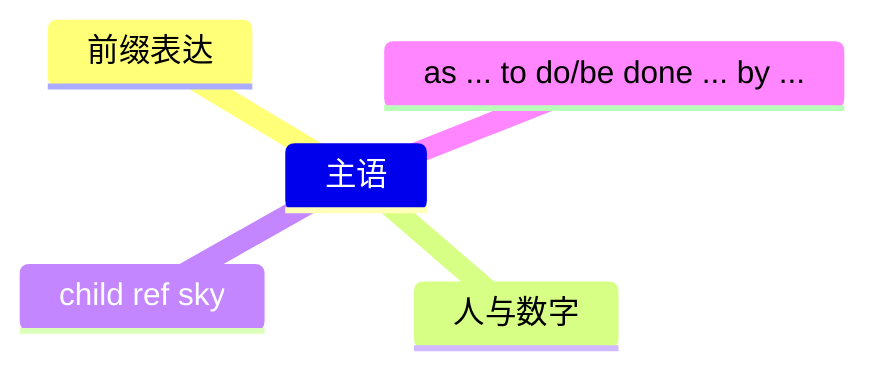

---
{"dg-publish":true,"permalink":"/数字花园/编程语法/lisp 基础语法，主语/"}
---





## 前缀表达

前缀表达，又称波兰表示法（Polish notation），s表达式，操作符置于操作数前，例如：

$$\text{+ 2 17 = 19}$$

```lisp
(+ 2 17)
;;=>19
```

如果仅仅是数字或者逻辑运算转换了一种表达方式，也许继续使用前缀表达是更好的。
但是如何在自然语言的角度去理解呢？
一般的自然语言语句一般有以下三种形式：

1. 主语－谓语－宾语
2. 主语－谓语
3. 谓语

试想一个基本的对话场景：

甲：吃饭了吗？
乙：吃了。

乙的话，说完整了，是：我吃过饭了。

把谓词对应于function，主语和宾语对应于variable，而 `吃了` 作为接收我和饭的谓语，以lisp的前缀表达形式，可以表示为：

```lisp
(吃了 我 饭)
```

或者

```lisp
(吃了 饭 我)
```

问题在于，第几个参数成为主语。前缀表达 `+ 2 19` 是不必在意这个问题的。是 `2` 努力令自身补充了 `19` 这个数值，还是 `19` 稍稍增加了 `2` 这个数值，因为加法交换律的缘故，只要它们的结果都是 `19`，算术者便通通视为等价的。

但是，`饭吃了我` 和 `我吃了饭` 对于准备吃饭的人来说，意义则尤为不同且重大。

## 人与数字

那么，存在于在列表中的元素，究竟是真实的人，还是抽象的数字？

对于是人的情况，比如甲把他所有的密码记在一张纸上，那么纸作为列表而单个密码作为元素：当甲访问网站x输入密码时，不是密码凭空地出现在了网站的输入栏，而是乙从他记录的密码中，选择了与网站x匹配的密码，输入到网站x的输入栏中。对于密码列表，是密码列表被选出了与网站x匹配的元素，对于网站，是网站被输入了与用户甲匹配的账户信息。

而对于是数字的情况，会存在一个脱离了人的生命而存在的数字吗？ `13` 这个数字或许是普遍存在的，只要这世上有多于 `13` 个行星，多于 `13` 棵树木，似乎便可认为这世界包含了数字 `13` 。但是，存在于世界中的 `13` 和存在于我们头脑中的 `13` 会是同一种事物吗？有什么理由能够说明，当世界的 `13` 个行星遇到第 `14` 个行星时，便包含了 `14` ？如果这 `13` 个行星会因为遇到第 `14` 个行星而毁灭，只留下第 `14` 个行星，那么这个世界便是不包含 `14` 的，对它而言 $13+1=1$。而通常认为 $13+1=14$ 的我们如果既不是被毁灭的十三个行星，也不是被留下的一个行星，那么我们又有什么理由认为，我们对这个世界经历 $13+1=1$的过程是有意义的呢？我们有什么理由认为，我们存在于这个世界呢？

至少对于数字的情况，我们可以理解到，人会因为参与各种事物的交互产生存在于世界的意义，而因为失去同各种事物的交互而失去存在于世界的意义。如果人具有存在于世界的意义，那么人至少要参与到同世界内的某种事物的交互中。

因此，综合元素为人和数字两种情形而言，如果一个列表和别的什么列表发生了交互，从而使自身失去、得到元素或改变了已有的元素，该列表便在程序的世界中产生了意义——它可能影响到其它列表，或被其它列表所影响。并且，提到列表影响其它列表，和它被其它列表所影响，是不同的。

对此，在lisp语言中，我想至少要能区分正在参与到程序中的列表，以及程序所包含的列表，而且以一种足够直观的形式加以表达。例如：

```lisp
(我 吃 饭)
```

```lisp
(饭 被吃 我)
```

好像不太通顺，借助一下英文的表达：

```lisp
(Rice is-eaten-by me)
```

完美。

## Child ref sky

然而lisp语言不存在该语序的直接实现，对此，可以设置一个宏语句，把第一个参数设置为主语，其余的参数设置为可能的宾语。而在所有的字母中，我个人认为字母 `o` 在形状上是最完美的。

```lisp
(defmacro o (mio ili &rest vio)
	`(ili mio ,@vio))
```
暂时称这种倒置了第一个参数和谓词的语句为 `自然语句` ，或者 `o语句` 吧。

于是重新看一看lisp的基础原语，也许 `set` 更换为 `is` 更加通顺呢？ `set` 的意义是设置，但是对于自然语句 `(o 'x set 1)` 而言，`x 设置 1` 这种句式是很蹩脚的。或者我们换一个例子 `(o '孩子 set '天空)` ：难道我们可以说， `孩子设置天空` 吗？天空可以通过向地面降下暴雨或冰雪来抑制生命的繁衍，亦或以阳光雨露滋润生命的成长。但是同样生活在地面的 `孩子` 有什么能力去设置这样的 `天空` 呢？难道更加自然的画面不是孩子在生命被暴雨或冰雪抑制之余，`望向` 了 `天空` 吗？或者他们的手 `指向` 了 `天空` ？

而按照 `s表达式` ，自然语句`(o '孩子 set '天空)` 对应着 `(set '孩子 '天空)` 。 `set` 的意义是令第一个符号指向第二个符号，这样在 `s 表达式` 中，我们便要说：`设置孩子指向天空`，或者 `设置孩子望向天空` 。这竟好似一种外在的诱惑，或者某种权威式的强制的命令，以役使孩子以他们期待的形式同天空发生关系一样。难道这外在的程序，还能比真正的 `天空` 更加宽广辽远吗？能够被命令着望向的 `天空` ，果真会是真正的 `天空` 吗？

如果对于每位孩子而言，存在一片真正可供他们自由飞翔的天空，我想这会比那一片片被命令或诱惑了的天空更接近他们自然而然所望向的远方。

不是因为某种外在的诱惑或命令，而是因为它自然而言朝向了什么。英语中有个词组 `refer to sth` ，意思是：

>to look at, or tell someone else to look at, a book or similar record in order to find information and help

为了简便起见，缩写为，`ref`。那么刚刚的语句便可以表达为： `(o child ref sky)` 。

```lisp
(defmacro ref (var value)
	`(setf ,var ,value))
```

## as ... to do/be done ... by ...

而回到 `week` 的例子中，试想不是 `(select week 2)` 这样，`选择了一周的第二天`，而是 `一周作为列表根据数字2被选择出来具有温度的第二天之元素`，也就意味着：

```lisp
(week as-list-be-select-element-by-position 2)
```

给予一种实现：

```lisp
(o as-list-be-select-element-by-position loy (list position)
   "列表根据位置被选择元素"
   (o (o list eq nil) then nil
      (o (o position = 1) then
         (o list ri)
         (o (o list cori) as-list-be-select-element-by-position (o position - 1)))))
;;(o '(a b c d) as-list-be-select-element-by-position 2)
;;=>b
```

其中，`loy` 是 `defun` 的倒装，`ri` 是 `car` 的倒装，`cori` 是 `cdr` 的倒装，`then` 是 `if` 的倒装。

在s表达式中，等价于

```lisp
(defun select (list position)
	(if (eq list nil) nil
		(if (= position 1)
			(car list)
		 (select (position cdr) (- position 1)))))
;;(select '(a b c d) 2)
;;=>b
```

当然，如果需要也可以把 `as-list-be-select-element-by-position` 缩写为 `be-select`。但是这样要如何区分 `as-string-be-select-substring-by-start-end` 以及 `as-number-list-be-select-max-number` 这些同样被选择，但是输入和输出类型和选择具体功能不同的函数呢？或者，如何证明，作为列表被选择比作为字串或作为数字列表被选择的优先级更高，以至于要它竟然要占用 `be-select` 这样精简的符号？如果不能，那么为什么要冒着浪费 `更精简的符号` 的选择空间的风险进行预设呢？既然一切都是 `Child ref sky.`
那么，`be-select` 这样的 `精简符号` 又为什么不能根据即时的执行和编写需求，进行灵活的指向关系改变呢？

精简的符号意味着更加快速的思考，而冗长的符号意味着更加精确的语义。对比认知科学中 `系统一` 和 `系统二` 的概念，也许应当存在一种可以整合这两种符号的编程范式？

如果我们把 `be-select` 这样的精简符号的组合称为 `架构类` 函数，那么 `as-list-be-select-element-by-position` `as-string-be-select-substring-by-start-end` `as-number-list-be-select-max-number` 无疑都是它的一种实现。一方面，这并不意味着作为 `架构类` 函数的 `be-select` 不可被执行了，可以根据语境进行设置，特别是对于一次执行且直执行一个函数的单线程而言。比较令人担忧的可能是，会不会出现当高级函数调用多个低级函数时，出现低级函数集合对于 `be-select` 的访问冲突？

另外，`as ...` 声明了主语的类型，这里的类型不一定是 `cons` `number` `string` 这些基础类型，也可以是 `table` `string-list` 这些自建类型。换言之 `作为...做/被做...根据...` 是自然语句的一种普遍的命名方式，例如：`as-table-be-select-column-by-position-list` `as-table-be-select-row-by-position` 。如果从主语的角度而言，`架构类函数` 和 `实现类函数` 之间的关系显然不是单继承的，只要考虑到任何一种作为自然语句主语的对象都有可能 `得到` `失去` 或 `改变` 什么的话。

## 参考

- [维基百科：波兰表示法](https://zh.m.wikipedia.org/wiki/%E6%B3%A2%E5%85%B0%E8%A1%A8%E7%A4%BA%E6%B3%95)
- [维基百科：逆波兰表示法](https://zh.m.wikipedia.org/wiki/%E9%80%86%E6%B3%A2%E5%85%B0%E8%A1%A8%E7%A4%BA%E6%B3%95)
- [维基百科：S表达式](https://zh.m.wikipedia.org/wiki/%E9%80%86%E6%B3%A2%E5%85%B0%E8%A1%A8%E7%A4%BA%E6%B3%95)
