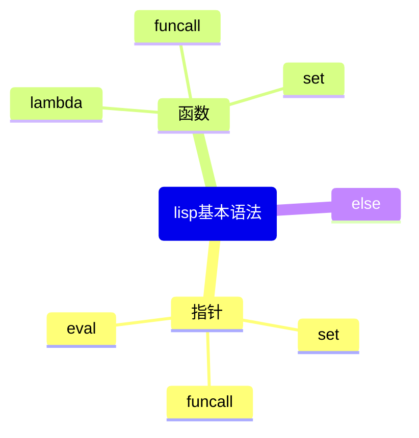
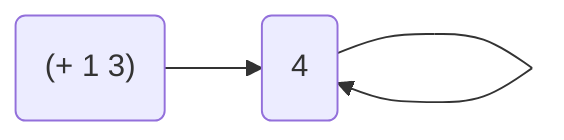
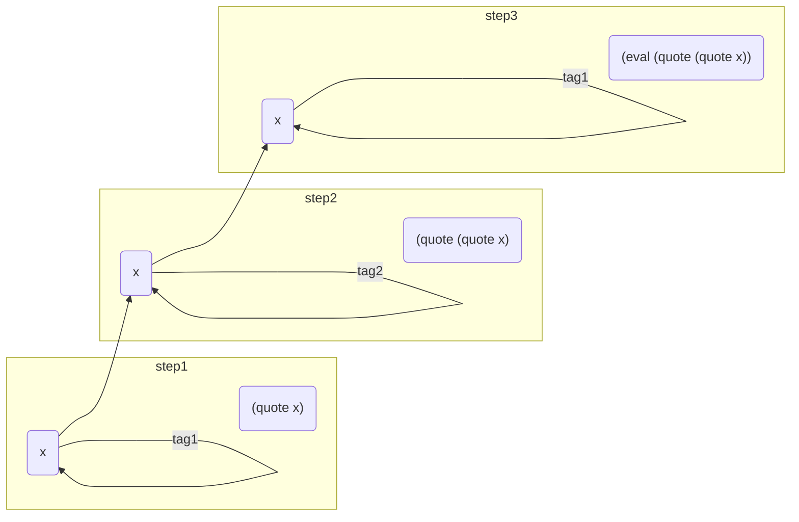
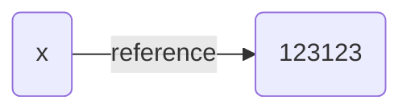
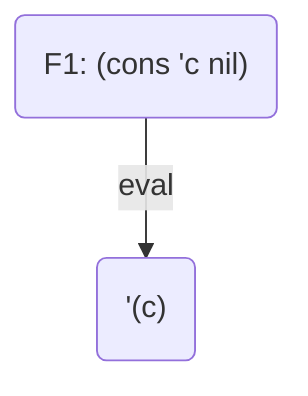
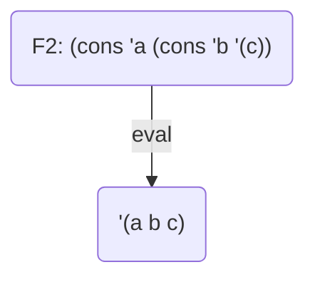
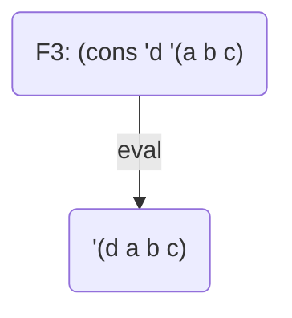
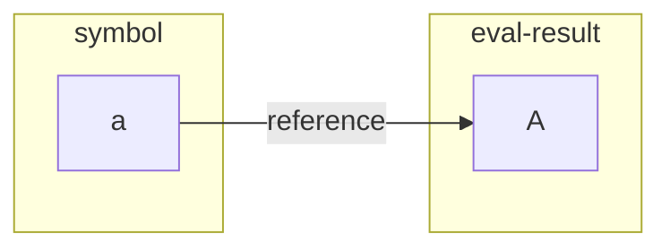
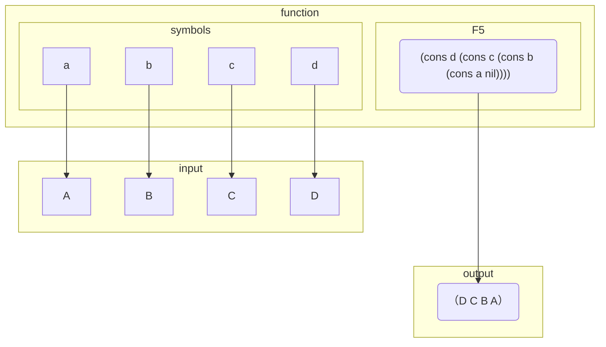
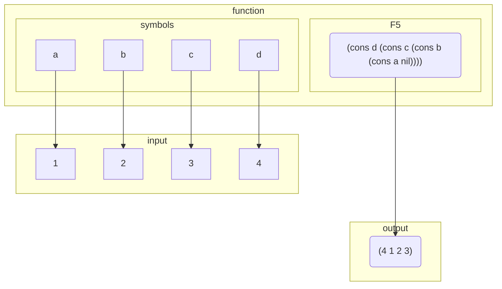

---
{"dg-publish":true,"permalink":"/数字花园/编程语法/lisp 基础语法，指针和函数/"}
---





## 基础操作语法表


| Grammer | 功能                               |
|:--------|------------------------------------|
| car     | 选取列表首项                       |
| cdr     | 选取列表非首项                     |
| eq      | 判断元素是否相等                   |
| if      | 条件分支                           |
| atom    | 是否为叶节点(不可分割、组合的原子) |
| quote   | 为符号增加指向自身的引用           |
| eval    | 返回符号的相邻引用值               |
| cons    | 连接对象                           |
| set     | 设置符号指针                       |
| lambda  | 设置匿名函数                       |
| funcall | 调用匿名函数                       |


## 简介

以下是lisp语言的基本形式。

```lisp
(symbol-1 symbol-2 ...)
```

每一个符号都可以展开为其它基本形式，或者和其它符号构成新的表达式，从而形成嵌套结构。

例如：

```lisp
(symbol-1 (symbol-2 symbol-3) symbol-4)
```

如果我们用 `symbol-5` 指向 `(symbol-2 symbol-3)` 这个整体，那么上述表达等价于：

```lisp
(symbol-1 symbol-5 symbol-4)
```

而如果我们用 `symbol-6` 指向 `(symbol-1 symbol-5 symbol-6)` 这个整体，那么上述表达等价于：

```lisp
symbol-6
```

如上所示，lisp程序的执行过程可以视为不断从里向外用新的符号替换原有表达式的过程。

只不过，一般情况下，第一个符号一般用于方法和函数的描述，这种表达方式又称为 `前缀表达` 。

## 举例

lisp程序的执行过程类似于上述简化过程，例如：

```lisp
(+ (- 3 2) 5)
```

`1` 等价于 `(- 3 2)`，进行替换得：

```lisp
(+ 1 5)
```

`6` 等价于 `(+ 1 5)`，进行替换得：

```lisp
6
```

所以，初始代码指向了 `6` 这个符号。

## 指针：set,quote 和 eval

指针指的是，一个符号指向另一个符号的关系。

如上述案例所示，符号有三种形式，在 `()` 内，被 `'` 引用，只有符号本身。


`set` 是用于规定指针的起点和终点。

`quote` 则用于创建指向符号自身的指针。

`eval` 用于获取符号指向的下一个符号。

需要注意，elisp语言中数字和字符串的指针永远指向它自身。

例如（以下等价的意义是说，等价的对象指针指向相同的目标）:

等价于

```lisp
(+ 1 3)
```

等价于


```lisp
(eval (+ 1 3))
```


等价于


```lisp
(eval (eval (+ 1 3)))
```

等价于

```lisp
(eval ...(eval (+ 1 3))...)
```


这是因为 `(+ 1 3)` 作为符号已经指向了 `4` 。无论 有多少个 `eval` 函数要求获取 `4` 指向的下一个符号，
我们永远都会得到 `4` 。




相应的，利用 `quote` 函数，我们可以回避一个符号被迫指向它的指针目标。

如果一次从内向外的函数调用处理符号 `x`，函数只包括 `quote` 和 `eval` 两项，并且每当 `eval` 被执行时，至少有一个 `quote` 被执行，那么无论这次函数调用有多长, `x` 被处理后所返回的符号，其指针路径永远 **经过**  `x`。


例如：

```lisp
(eval (quote 'x))
;;=>x
```

```lisp
(eval (quote (quote 'x)))
;;=>(quote x)
```

```lisp
(eval (eval (quote (quote 'x))))
;;=>x
```

可以观察到，eval一次仅仅消除一层quote。




而set可以为我们为符号设置一个特定的指针，以便其被执行时，指向特定符号。例如

```lisp
(set 'x "123123")
```

意味着符号 `x` 指向了 字串符号 `"123123"`




### 举例

我们可以用 `set` 或 `约定` 关键字来设置一种替换过程：

首先，我们约定：`f1` 指向 `(cons 'c nil)`，`f2` 指向 `(cons 'a (cons 'b (eval f1)))`， `f3` 指向 `(cons 'd (eval f2))`：
```lisp
(set 'f1 '(cons 'c nil))
(set 'f2 '(cons 'a (cons 'b f1)))
(set 'f3 '(cons 'd (eval f2)))
```

（`cons` 的意义是把两个符号结合在一起。）

分别执行 `f1` `f2` `f3` 

```lisp
(eval f1)
(eval f2)
(eval f3)
```

得到：


| 执行符号 | 执行结果  |
|----------|-----------|
| f3       | (d a b c) |
| f2       | (a b c)   |
| f1       | (c)          |


现在我们约定另外两段代码：

```lisp
(set 'F2 '(cons 'a (cons 'b (cons 'c nil)))
(set 'F3 '(cons 'd (cons 'a (cons 'b (cons 'c nil)))))
```


分别执行f3 F3 f2 F2，得到结果：

| 执行符号 | 执行结果  |
|----------|-----------|
| f3, F3   | (d a b c) |
| f2, F2   | (a b c)          |


以F3的执行过程为例，我们可以把F3的从内向外执行过程理解为：


步骤一：



步骤二：



步骤三：





最后需要注意的是：

`(x ...)` 本身相当于以下 `eval` 语句：

```emacs-lisp
(funcall (lambda (x ...) (eval (x ...))) x ...)
```

不过，eval在何种程度上与`()`等价，quote在何种程度上与 `'` 等价，我暂时还没有理解清楚。


## 函数：set，funcall和lambda

如果我们从内向外把上述案例中 `cons` 语句中输入的字符提取出来，我们可以得到 `a b c d`。而执行结果则是： `(d a b c)` 。

我们在一开始提到，每一个符号都可以展开为其它基本形式。

那么，如果`a b c d` 具有以下指针形式如何呢？

| 符号 | 指针目标1 | 指针目标2 |
|------|-----------|-----------|
| a    | 1         | A         |
| b    | 2         | B         |
| c    | 3         | C         |
| d    | 4         | D          |

我们可以尝试以下代码：

```lisp
(set 'a 1)
(set 'b 2)
(set 'c 3)
(set 'd 4)
(set 'F4 '(cons d (cons c (cons b (cons a nil)))))
(eval F4)
;;=>(4 3 2 1)

(set 'a A)
(set 'b B)
(set 'c C)
(set 'd D)
(set 'F5 '(cons d (cons c (cons b (cons a nil)))))
(eval F5)
;;=>(D A B C)
```

（考虑一下 `F4` 和 `F3` 有什么不同，为什么不同？）

可以看到，代码将输入字符 `1 2 3 4` 和 `A B C D`的最后一个元素放在第一位，按照新的顺序建立了列表 `(4 3 2 1)` 和 `(D A B C)`。

换言之，如果我们希望 **把某四个符号的第一个元素放在第一项并把它们组合在一起得到新的列表** ，我们只需要通过 `set` 修改 `a b c d` 的指针，而不需要修改 `F5` 。在这里， `F5` 不再是一种指向特定符号的符号，它的指向相比于指针发生了一种根本性的转向。

以F5为例我们尝试对比以下代码：


```lisp
(set 'a 'A)
(eval 'a)
;;=>A
```

其中的指针关系可以用下图表示：




eval的结果和指针目标是相同的 `A`。

但是 `f5` 的eval结果显然是 `a b c d` 以外的符号。指向关系如下图所示：





如果我们更换 符号 `a b c d` 所指向的对象，那么相应的输出结果也会改变：




这和我们对于函数的通常理解是一致的： `给定输入元素，进行处理，给定输出` 。那么，既然我们可以通过
 `set` 和 `eval` 构建出函数的模型，那么 `defun` 似乎便可以由 `set` 和 `eval` 的基本组合而替代。

```lisp
(set 'x 4)
(set 'plus-one (+ x 1))
(eval 'plus-one)
;;=>5

plus-one
;;=>5

(set 'x 9)
(eval 'plus-one)
;;=>10

plus-one
;;=>10
```

```lisp
(defun plus-one (x) (+ x 1))
(plus-one 4)
;;=>5

(plus-one 9)
;;=>10
```

但是这样有一个命名问题，如果多个函数都需要调用符号 `x` 该如何处理呢？

例如我们要求把数字 `3 2 1` 分别加一后返回给 `z`：

```lisp

(defun plus-one (x) (+ x 1))
(defun sum-abc (a b c) 
	(+ (plus-one a) 
		(plus-one b) 
		(plus-one c)))
		
(set z (sum-abc 3 2 1))
;;=>9
```

```lisp
(set 'plus-one '(+ 1 (eval (eval x))))
(set 'sum-abc '(progn
	(set 'x 'a)
	(set 'z (+ z (eval plus-one)))
	(set 'x 'b)
	(set 'z (+ z (eval plus-one)))
	(set 'x 'c)
	(set 'z (+ z (eval plus-one)))
	))

(set 'a 3)
(set 'b 2)
(set 'c 1)
(set 'z 0)
(eval sum-abc)
;;=>9

(set 'a nil)
(set 'b nil)
(set 'c nil)
(set 'z nil)
```

对于单线程程序而言，由于每一次执行且只执行一个函数，所以，只要在每一次执行函数后，将 `x` 的值归为 `nil` 或者 `x` 本身似乎便令 `set`-`quote`-`eval` 实现与 `defun` 相同的功能。但是，为了输入变量，消除函数间影响而增加的 `set` 语句，以及为了令函数功能一般化而增加的 `quote` 和 `eval` 语句会增加相当程度的代码量。

elisp语言提供了两个基本操作来减少这些工作量：

首先是 `lambda` 对于 `quote` 和 `eval` 语句的避免。

在 `set-quote-eval` 的函数实现中，我们通过 `quote` 避免函数 `plus-one` 在定义阶段被执行后指向符号结果。同时在函数 `sum-abc` 中我们通过 `eval` 语句调用函数 `plus-one` 返回相应结果。

而如果我们使用 `lambda` 无名函数表达，同样的功能可以用以下代码实现：

```lisp
;;plus-one
(lambda (x) (+ 1 x))
;;sum-abc
(lambda (a b c) (+ (plus-one a) (plus-one b) (plus-one c)))
```
这段代码存在两个错误，第一，lambda函数是无名函数，如果不设置指针指向它，是无法通过符号调用的，所以，函数 `plus-one` 需要增加 `set` 语句才能完成定义。第二，和基本操作或者 `defun` 可以直接作为前缀表达式的首项调用函数不同，通过 `set` 定义的 `lambda` 需要利用 `funcall` 才能进行调用。所以，上述代码应该改为：

```lisp
(set 'plus-one (lambda (x) (+ x 1)))
(set 'sum-abc 
	(lambda (a b c)
		(+ (funcall plus-one a)
			(funcall plus-one b)
			(funcall plus-one c))))

(funcall sum-abc 3 2 1)
;;=>9
```

至少相比与 `set-quote-eval`实现，我们避免了重复设置指针来在函数 `sum-abc` 中调用函数 `plus-one`。

从表达形式而言，符号 `funcall sum-abc` 函数调用则等价于 `defun` 实现中的 `sum-abc` 函数调用。


到这里位置，本篇博客篇幅已经很长了。至于列表和分支语句，下一篇博客中再进行记录吧。

（关于 F4 和 F3 的不同，不同点在于 `F4` 去除了符号 `a b c d` 的引用，从而使得 `F4` 处理的对象从 符号  `a b c d` 本身指向 `a b c d` 指向的符号。）

## 参考

- [中文维基：lisp](https://zh.wikipedia.org/wiki/LISP)
- [GNU: Emacs Lisp Refference Manual](https://www.gnu.org/software/emacs/manual/elisp.html)


